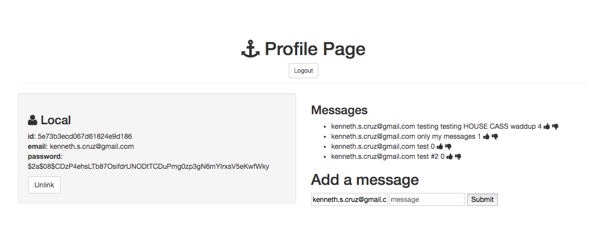

## Installation

1. Clone repo
2. run `npm install`

## Usage

1. run `node server.js`
2. Navigate to `localhost:8080`

## Explanation

In this project I am using User Authentication to create a profile.
Then the individual user can create a message board.
Then the message board page is modified to only use the messages
that the user has made, filtering out other users' messages for
privacy purposes.
